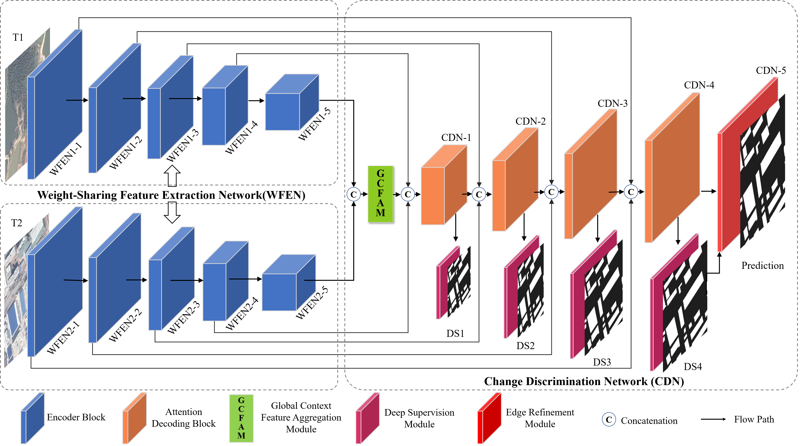

# AERNet: An Attention-Guided Edge Refinement Network and a Dataset for Remote Sensing Building Change Detection
For more ore information, please see our published paper at [IEEE TGRS](https://ieeexplore.ieee.org/abstract/document/10209204)  

# Requirements
Python 3.6  
pytorch 1.7.1  
torchvision 0.8.2  
CUDA 10.1
# HRCUS-CD
HRCUS-CD: 链接：https://pan.baidu.com/s/12lvhm8ZNhgshngF7GDsj_Q   提取码：igw4
# Citation
If you use this code or dataset for your research, please cite our paper:  

J. Zhang et al., "AERNet: An Attention-Guided Edge Refinement Network and a Dataset for Remote Sensing Building Change Detection," in IEEE Transactions on Geoscience and Remote Sensing, vol. 61, pp. 1-16, 2023, Art no. 5617116, doi: 10.1109/TGRS.2023.3300533.

or

@ARTICLE{10209204,  
  author={Zhang, Jindou and Shao, Zhenfeng and Ding, Qing and Huang, Xiao and Wang, Yu and Zhou, Xuechao and Li, Deren},  
  journal={IEEE Transactions on Geoscience and Remote Sensing},   
  title={AERNet: An Attention-Guided Edge Refinement Network and a Dataset for Remote Sensing Building Change Detection},   
  year={2023},  
  volume={61},  
  number={},  
  pages={1-16},  
  doi={10.1109/TGRS.2023.3300533}}
